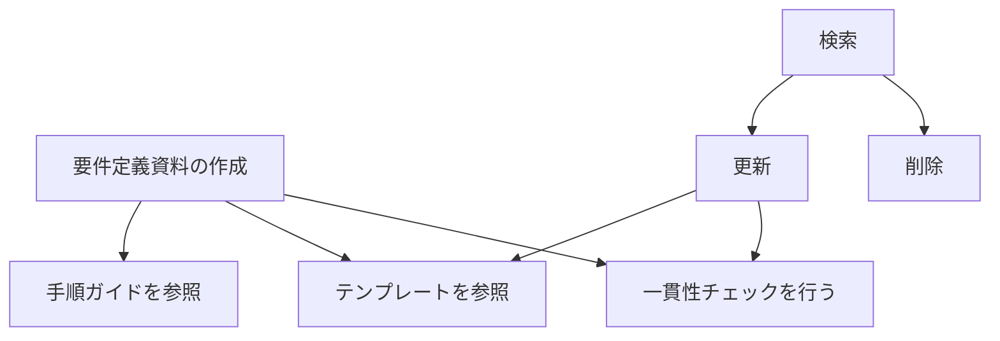

# 1.1.4: バージョン1.0評価

## CRUD

### 要件定義資料

| ユーザーストーリーID | データ       | C(作成) | R(参照) | U(更新) | D(削除) |
| -------------------- | ------------ | ------- | ------- | ------- | ------- |
| UST001               | 要件定義資料 |         | ●       | ●       |         |
| UST003               | 要件定義資料 |         | ●       | ●       |         |
| UST010               | 要件定義資料 | ●       | ●       |         |         |
| UST011               | 要件定義資料 |         | ●       | ●       |         |
| UST012               | 要件定義資料 |         | ●       |         | ●       |
| UST013               | 要件定義資料 |         | ●       |         |         |

### 1.3 ユーザーストーリーマップ

### 1.3 システム制約

- UST008: 要件の変更部分を簡単に確認できるようにしたい
- UST009: AIエージェントは要件定義の提案をしたい
