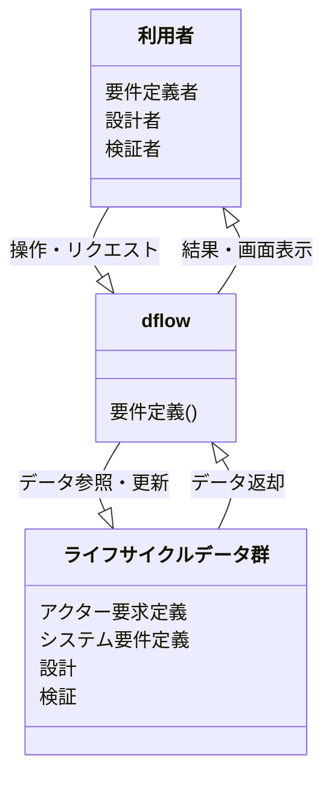
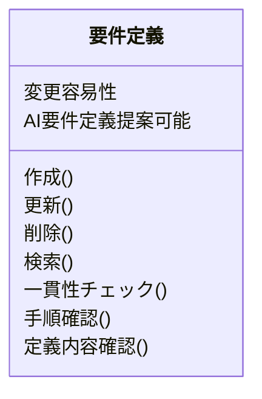
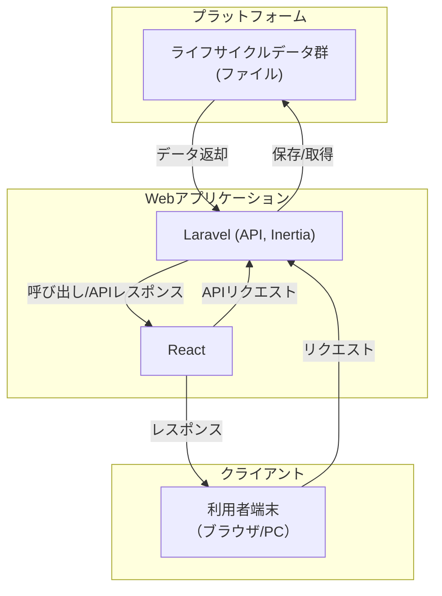
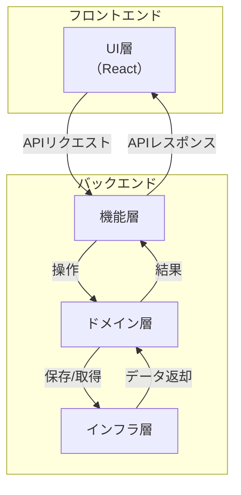

# システムイベント図

# ソフトウェアイベント図

# 技術スタック

- Docker
- PHP 8.4
- Laravel 12 (Inertia)
- React 19

# システムアーキテクチャ図

## システムインターフェース

### 1. 利用者端末 ― Webアプリケーション

- インターフェース名：Web UI/APIインターフェース
- プロトコル：HTTP（REST API, WebSocket等）
- 入力：HTTPヘッダー、クエリパラメータ、JSON、ファイル（multipart/form-data）
- 出力：HTTPヘッダー、HTML、JSON、ファイル（application/octet-stream, text/csv等）
- 非機能要件：レスポンス性能、セッション管理、エラーハンドリング

### 2. Webアプリケーション ― ライフサイクルデータ群

- インターフェース名：データ永続化インターフェース
- プロトコル：ファイルI/O
- 入力：YAML, JSON, CSV, テキスト等
- 出力：ファイル（YAML, JSON, CSV, テキスト等）
- 非機能要件：トランザクション管理、データ整合性

# アプリケーションアーキテクチャ図

## アプリケーションインターフェース

### バックエンド ― フロントエンド

- インターフェース名：Webインターフェース
- プロトコル：HTTP（REST API）、WebSocket、Inertia.js通信
- 入力：JSON、HTTPヘッダー
- 出力：JSON、HTTPヘッダー
- 非機能要件：
  - レスポンス性能
  - エラーハンドリング
  - セキュリティ（CSRF/XSS/SQLインジェクション対策等）
