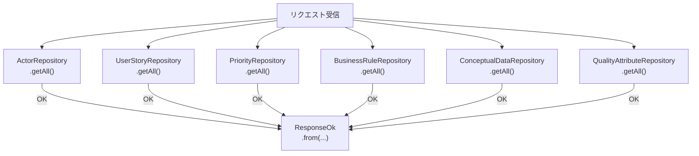
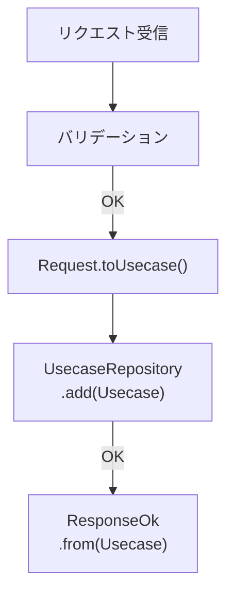
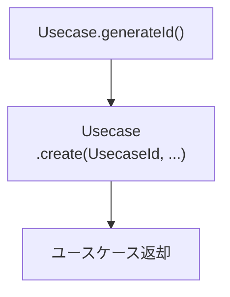

# DF001. ユースケース作成

## 概要

ユースケース作成機能のサーバーサイド設計。Inertia経由でユースケース情報を受け取り、バリデーション・永続化・応答を行う。

---

## エンドポイント

| メソッド | パス                              | 概要                     |
| -------- | --------------------------------- | ------------------------ |
| GET      | /system-requirements/usecases/new | ユースケース新規作成入力 |
| POST     | /system-requirements/usecases     | ユースケース新規作成     |

---

## ユースケース新規作成入力

### コントローラメソッド

#### SystemRequirement/Feature/Usecase/UsecaseController::new(): Response

ユースケースを作成フォーム

##### プロセスフロー図

---

## ユースケース新規作成

### コントローラメソッド

#### SystemRequirement/Feature/Usecase/UsecaseController::create(Request): Response

ユースケースを作成

##### プロセスフロー図

---

### サービスメソッド

#### SystemRequirement/Feature/Usecase/Create/Request::toUsecase(): Usecase

リクエストからユースケースに変換して返す

##### プロセスフロー図

#### SystemRequirement/Feature/Usecase/Create/Validation::rule(): array

##### バリデーション

**ID**

| 属性名 | バリデーション           |
| ------ | ------------------------ |
| id     | required, string, max:21 |

**タイトル**

| 属性名 | バリデーション            |
| ------ | ------------------------- |
| title  | required, string, max:100 |

**説明**

| 属性名      | バリデーション            |
| ----------- | ------------------------- |
| description | required, string, max:500 |

**トリガー**

| 属性名   | バリデーション                  |
| -------- | ------------------------------- |
| triggers | required, array, min:1, max:100 |

**事前条件**

| 属性名           | バリデーション            |
| ---------------- | ------------------------- |
| preConditions    | present, array, max:100   |
| preConditions.\* | required, string, max:100 |

**事後条件**

| 属性名                                            | バリデーション                  |
| ------------------------------------------------- | ------------------------------- |
| postConditionSets                                 | required, array, 通常フロー必須 |
| postConditionSets.\*.postConditions.flowId        | required, string, max:10        |
| postConditionSets.\*.postConditions.conditions    | required, array, min:1, max:100 |
| postConditionSets.\*.postConditions.conditions.\* | required, string, max:100       |

**通常フロー**

| 属性名                          | バリデーション                  |
| ------------------------------- | ------------------------------- |
| normalFlow.id                   | required, string, max:10        |
| normalFlow.name                 | required, string, max:100       |
| normalFlow.steps                | required, array, min:1, max:100 |
| normalFlow.steps.\*.description | required, string, max:100       |
| normalFlow.steps.\*.flowIds     | present, array, max:100         |
| normalFlow.steps.\*.flowIds.\*  | required, string, max:10        |

**代替フロー**

| 属性名                               | バリデーション                  |
| ------------------------------------ | ------------------------------- |
| alternativeFlow.id                   | required, string, max:10        |
| alternativeFlow.name                 | required, string, max:100       |
| alternativeFlow.steps                | required, array, min:1, max:100 |
| alternativeFlow.steps.\*.description | required, string, max:100       |
| alternativeFlow.steps.\*.flowIds     | present, array, max:100         |
| alternativeFlow.steps.\*.flowIds.\*  | required, string, max:10        |

**例外フロー**

| 属性名                             | バリデーション                  |
| ---------------------------------- | ------------------------------- |
| exceptionFlow.id                   | required, string, max:10        |
| exceptionFlow.name                 | required, string, max:100       |
| exceptionFlow.steps                | required, array, min:1, max:100 |
| exceptionFlow.steps.\*.description | required, string, max:100       |
| exceptionFlow.steps.\*.flowIds     | present, array, max:100         |
| exceptionFlow.steps.\*.flowIds.\*  | required, string, max:10        |

**頻度**

| 属性名    | バリデーション            |
| --------- | ------------------------- |
| frequency | required, string, max:100 |

**その他情報**

| 属性名    | バリデーション           |
| --------- | ------------------------ |
| otherInfo | present, string, max:500 |

**前提条件**

| 属性名         | バリデーション            |
| -------------- | ------------------------- |
| assumptions    | present, array, max:100   |
| assumptions.\* | required, string, max:100 |

**項目詳細**

| 属性名                | バリデーション           |
| --------------------- | ------------------------ |
| itemDetails.viewItem  | present, string, max:500 |
| itemDetails.inputItem | present, string, max:500 |
| itemDetails.event     | present, string, max:500 |

**ユーザーストーリー**

| 属性名          | バリデーション                  |
| --------------- | ------------------------------- |
| userStoryIds    | required, array, min:1, max:100 |
| userStoryIds.\* | required, string, max:21        |

**アクター**

| 属性名      | バリデーション                  |
| ----------- | ------------------------------- |
| actorIds    | required, array, min:1, max:100 |
| actorIds.\* | required, string, max:21        |

**優先度**

| 属性名     | バリデーション           |
| ---------- | ------------------------ |
| priorityId | required, string, max:21 |

**ビジネスルール**

| 属性名             | バリデーション           |
| ------------------ | ------------------------ |
| businessRuleIds    | present, array, max:100  |
| businessRuleIds.\* | required, string, max:21 |

**関連概念データ**

| 属性名               | バリデーション           |
| -------------------- | ------------------------ |
| conceptualDataIds    | present, array, max:100  |
| conceptualDataIds.\* | required, string, max:21 |

**品質属性**

| 属性名                 | バリデーション           |
| ---------------------- | ------------------------ |
| qualityAttributeIds    | present, array, max:100  |
| qualityAttributeIds.\* | required, string, max:21 |

---
